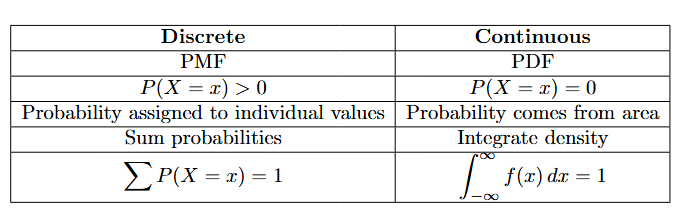
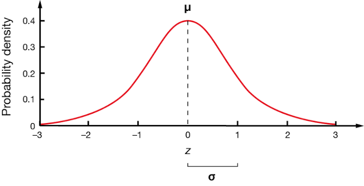
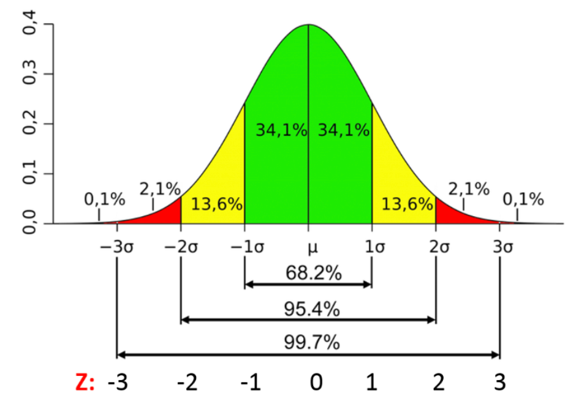
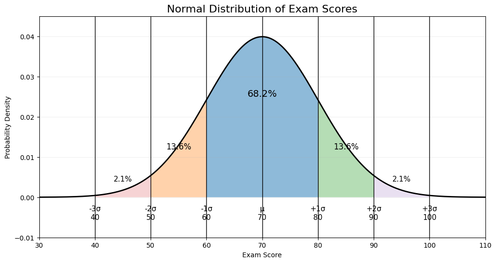
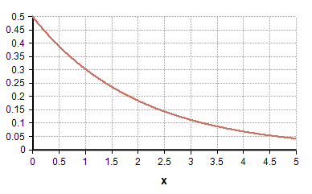
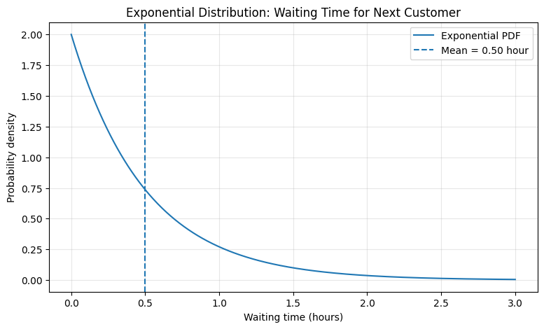
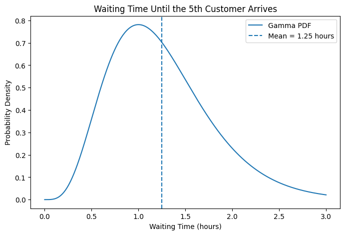
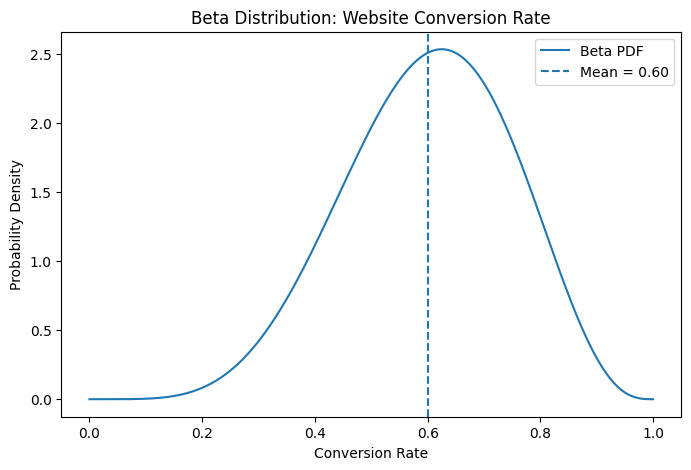
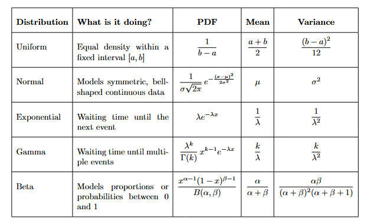

# Continuous Probability Distributions: From Curves to Probability #

## Understanding Uniform, Normal, Exponential, Gamma, and Beta distributions through intuition, mathematics, and real-world examples ##

In my previous blog "Bernoulli Asked “Success or Failure.” Poisson Asked “How Many?" I already discussed *Discrete Probability Distributions*.

I took a deep dive into the 6 most important *distributions* in it. Moving a step ahead, now it is turn of **Continuous Probability Distributions**. Similarly as I dissected my last blog word by word, in the same fashion I'm going to open layers of this blog.

Now I think we are very much clear about the topics like *Random Variable* and *Probability Distributions*. So as the name suggests, "Continuous Probability Distributions" are used when the random variable can take values from a continuous range, such as $X\in[0,1]$.

As discussed earlier, to understand the structure of the data and get proper knowledge of what we are working with we should know about the *Probability Distributions*.

The function for **Continuous Probability Distributions** is called **"Probability Density Function(PDF)"**. I would like to mention here again that, the function here is called so because unlike "Discrete Probability Distributions", here we deal with area under the graph over an interval. The probability at any exact point is 0, so we work with intervals instead. Working with an interval makes it more feasible and interpretable. Hence the name **Density** came into picture. This was just a brief discussion, if you want to learn about it more please go check out my blog **"PMF, PDF & CDF: Three Ways Probability Helps Us Understand Data"** on Medium. 

Two most important things to keep in mind about *PDF*:

1. $$f(x)≥0$$
2. $$\int_{-\infty}^{\infty} f(x) \, dx = 1$$


Just to be sure from my side that no confussion is left between *PMF* and *PDF* I am providing you with the summary table below:



Also I hope we are well familiar here with **Cumulative Distribution Function**. Just a brief intro it is

$$ F(x)=P(X\le x) $$

and it is the area under the PDF from $(-\infty)$ to $(x)$.

Differentiating the **CDF** gives the **PDF** where the derivative exists.*

### Expected Value and Variance for Continuous Variables ###

Mean

For a continuous random variable:

$$E[X]=\int_{-\infty}^{\infty}x f(x)\,dx$$


Instead of multiplying each possible value by its probability, we now weight every possible value by its density and integrate.

Variance
$$Var(X)=E[(X-\mu)^2]$$

and

$$Var(X)=E[X^2]-\mu^2$$

where

$$E[X^2]=\int_{-\infty}^{\infty}x^2 f(x)\,dx$$

There are many Continuous Distributions but here is my blog we will be discussing main 5 of them:

 - Uniform Distribution
 - Normal Distribution
 - Exponential Distribution
 - Gamma Distribution
 - Beta Distribution


Let's begin with our first one,

**1. Uniform Distribution**

What if we choose an interval and the density is the same throughout that interval, it is called *"Uniform"* right and hence we are dealing with probability we will get a *distribution*, making the name suitable as **Uniform Distribution**.

We denote it as *"X ~ U(a,b)"* and (a,b) represents $a≤X≤b$. The distinction at the endpoints doesn't affect the probability because individual points have probability zero, but your PDF later uses \(a\le x\le b\), so make the notation consistent.

The thing to note here is, for a **continuous random variable**, the probability at any exact point is zero.

So, as talked above the distribution is uniform hence it should look something like rectangle. Hence the **PDF** is $$\frac{1}{(b-a)}$$ where, a ≤ x ≤ b.

Let us unfold the PDF, *The total area under a PDF must equal 1* and we already know it distribution looks like rectangle so,

$$Area = width × height$$

$$(b−a) × f(x) = 1$$

Therefore,

$$f(x) = 1/(b-a)$$

Outside the interval the density remains 0.

A discussion about distributions is incomplete till we talk about its *mean* and *variance*. 

So **Mean** as mentioned above looks something like, $$E[X]=\int_{-\infty}^{\infty}x f(x)\,dx $$ here by substituting the value of *f(x)* from above we will get 

$$E[X]=\int_{a}^{b}x (\frac{1}{b-a})\,dx$$

after integration we are left with result,

$$E[X] = \frac{1}{b-a}\left[\frac{x^2}{2}\right]_a^b​​$$

$$E[X] = \frac{1}{b-a}\left(\frac{b^2}{2} - \frac{a^2}{2}\right) = \frac{b^2 - a^2}{2(b-a)}$$

Factor the numerator using the difference of squares:

$$b^2 - a^2 = (b-a)(b+a)$$

So:

$$E[X] = \frac{(b-a)(b+a)}{2(b-a)}$$

Cancel $(b-a)$:

$${E[X] = \frac{a+b}{2}}$$

This result makes sense.

If every point between \(a\) and \(b\) is equally represented, the average lies exactly in the middle.

Variance on the other hand is,

$$E[X^2]=\int_{-\infty}^{\infty}x^2 f(x)\,dx$$

again substituting the value of *f(x)*,

$$E[X^2]=\int_{a}^{b}x^2 (\frac{1}{b-a})\,dx$$


$$E[X^2] = \frac{1}{b-a}\left[\frac{x^3}{3}\right]_a^b = \frac{b^3-a^3}{3(b-a)}$$

Using the difference of cubes:

$$b^3 - a^3 = (b-a)(b^2+ab+a^2)$$

we get:

$$E[X^2] = \frac{a^2+ab+b^2}{3}$$

We already know:

$$E[X] = \frac{a+b}{2}$$

Therefore,

$$\text{Var}(X) = \frac{a^2+ab+b^2}{3} - \left(\frac{a+b}{2}\right)^2$$

After simplifying:

$$ \text{Var}(X) = \frac{(b-a)^2}{12} $$
---

Now let us see it through an example,

**Question:**

Imagine you are listening to a playlist on shuffle. Your favorite song is somewhere in a 30-minute podcast, and you have no information suggesting that it is more likely to occur at one particular time than another.

Let \(X\) be the time, in minutes, at which the song starts.

We assume:

$$ X\sim U(0,30) $$

So the song could start anywhere between 0 and 30 minutes, with equal probability density.

1. What is the probability that the song starts between 10 and 18 minutes?

The total interval is:

$$30-0=30$$

The interval we're interested in is:

$$18-10=8$$

Therefore:

$$P(10 \lt X \lt 18) = \frac{18-10}{30-0}$$ $$ =\frac{8}{30} $$ $$ =\frac{4}{15} \approx0.2667 $$

So:

$$P(10 \lt X \lt 18)\approx26.67\%$$

2. What is the expected time?

For a Uniform Distribution:

$$E[X]=\frac{a+b}{2}$$

Therefore:

$$E[X]=\frac{0+30}{2}=15$$

So the expected time is 15 minutes.

This doesn't mean the song will actually start at exactly 15 minutes. It means that if we repeated this situation many times, the average starting time would approach 15 minutes.

3. What is the variance?

The variance is:

$$\text{Var}(X) = \frac{(b-a)^2}{12}$$

Therefore:

$$\text{Var}(X) = \frac{(30-0)^2}{12}$$
$$=\frac{900}{12}$$
$${\text{Var}(X)=75}$$

And the standard deviation is:

$$\sigma=\sqrt{75}\approx8.66$$

So:

$$σ≈8.66$$

8.66 minutes

     *This is a modeling assumption. In a real playlist, song positions aren't necessarily uniformly distributed.*

```
import numpy as np
from scipy.stats import uniform
import matplotlib.pyplot as plt

# Parameters
a = 0
b = 30

# Create Uniform Distribution
X = uniform(loc= a,scale= b-a)

# Create x values
x = np.linspace(a,b,1000)

# Calculate PDF
pdf = X.pdf(x)

# Mean and standard deviation
mean = X.mean()
std = X.std()

print("Mean:", mean)
print("Variance:", X.var())
print("Standard Deviation:", std)

# Plot
plt.figure(figsize=(10, 5))

plt.plot(x, pdf, linewidth=2)

# Mean
plt.axvline(mean, linestyle="--", linewidth=2,
            label=f"Mean = {mean:.0f} minutes")

# One standard deviation on each side
plt.axvline(mean - std, linestyle=":", linewidth=2,
            label=f"Mean - SD = {mean-std:.2f}")

plt.axvline(mean + std, linestyle=":", linewidth=2,
            label=f"Mean + SD = {mean+std:.2f}")

plt.xlabel("Time after the start of the podcast (minutes)")
plt.ylabel("Probability Density")
plt.title("Uniform Distribution: Song Start Time")
plt.legend()
plt.grid(alpha=0.3)

plt.show()
```


---

**2. Normal Distribution**

Before understanding this, I want you to appreciate the fact that this is the most widely used distribution. One must have good understanding of *Normal Distribution* to understand many algorithms used in machine learning. 

To understand this, we should first discuss **z-score**, it is: 

     How far is a value x from the mean, measured in standard deviations?

*"measured in standard deviations"* can sound confusing so in simpler way we can understand it as: 

*"Instead of measuring distance in the original units, we measure how many standard deviations away from the mean the value is."*

i.e if σ = 10 units then 1 standard deviation = 10 units.

*Positive z-score*:
$$z>0$$

means the value is above the mean.

*Negative z-score*:
$$z<0$$

means the value is below the mean.

*Zero z-score*:
$$z=0$$

means:

$$ x=\mu $$

The value is exactly at the mean.

But isn't it a valid thing to ask, why do we need to divide it by standard deviation?

We must clear this with an example:

Test 1:

Mean = 70

SD = 10

Score = 80

$$z=\frac{80-70}{10}=1$$

Test 2

Mean = 50

SD = 5

Score = 55

The raw scores are completely different:

$$80 \neq 55 $$

But:

$$z=\frac{55-50}{5}=1 $$

Both students are:

$${1\text{ SD above their respective means}} $$

So their relative positions within their distributions are the same.

That's the power of the standardization. Therefore we say **Z-score is a standardized score.**

One must not confuse *z-score* with *probability*

*z = 1* and *P(X = 1) = 1* are not the same thing.
To get probability, we need to use the **Normal Distribution/CDF**.

     "A z-score doesn't tell us how large a value is, it tells us where that value stands relative to the mean, measured in standard deviations."

The mathematical notation is:

$$X∼N(μ,σ^2)$$



Usually:

1. Most observations are somewhere around the average.
2. Fewer observations are far away from the average.
3. Very extreme values are rare.

**That gives us the familiar bell-shaped curve.**

A normal distribution has three important characteristics:

   1. It is symmetric
   2. Mean = Median = Mode = $\mu$
   3. The tails get closer and closer to zero

The **PDF** here is:
$$f(x) = \frac{1}{\sigma \sqrt{2\pi}} e^{-\frac{1}{2}\left(\frac{x-\mu}{\sigma}\right)^2}$$

Isn't it scary at first glance? But let us break through it.

The part inside the exponent, i.e. $$\frac{x-\mu}{\sigma}$$, is the z-score, now we are clear with it I hope. 

We are squaring the z-score to get the symmetric values, if we don't square, it will give different values for positive and negative exponential, which won't make it symmetrical. Hence squaring solves our problem. 

The farther x moves from μ, the larger $$z^2$$ becomes, so the density becomes smaller.

That's why we get a bell shape.

But what is the need? We had above *Uniform Distributions's PDF*, that was so simple why couldn't we use it as it is? 

In case of *Uniform Distribution PDF* we were dealing with uniform density, so the graph was rectangular but here as far as a point moves from its mean the density decreases or the density changes depending on how far we are from the mean.

At the center:

$$x=\mu$$

so:

$$f(\mu) = \frac{1}{\sigma\sqrt{2\pi}}$$

This is the highest point of the curve.

As x moves away from μ, the density decreases.

The normal density is defined so that

$$\int_{-\infty}^{\infty} e^{-z^2/2}\,dz = \sqrt{2\pi} $$

Therefore, to make the total area equal to 1, we divide by $\sqrt{2\pi}$

That's where we get:

$$\frac{1}{\sqrt{2\pi}} e^{-z^2/2}$$

This is called the **standard normal distribution.**

So:

$${ \frac{1}{\sqrt{2\pi}} } $$

normalizes the total area to 1.

And lastly dividing by $\sigma$ adjusts the height when the curve is stretched/compressed.

The **Mean** here is:

$$E[X]=μ$$

*(Where is the bell curve located?)*

and the **Variance** is:

$$Var(X)=σ^2$$

*(How wide or narrow is the bell curve?)*

Do you remember at the very beginning I told you this is the most widely used distribution, in the further section you will realise the same.

**The famous 68–95–99.7 rule**

Within 1 standard deviation
$$\mu-\sigma<X<\mu+\sigma$$

contains about:

$$ 68\% $$

of the observations.

Within 2 standard deviations
$$\mu-2\sigma<X<\mu+2\sigma$$

contains approximately:

$$ 95\% $$
Within 3 standard deviations
$$\mu-3\sigma<X<\mu+3\sigma$$

contains approximately:

$$ 99.7\% $$

So visually:

$$ 68\%-95\%-99.7\% $$



About 68% of observations lie within 1 standard deviation of the mean.

It's the area under the curve between -1 and +1.

So:

$$P(−1≤Z≤1)=0.682$$

The normal distribution is symmetric. Therefore splitting 68.2 into half gives us 34.1%.

About 95.4% of observations are within 2 standard deviations of the mean.

Then between $(2\sigma)$ and $(3\sigma)$:

$$ 2.1\% $$

on each side.

---
**Question**

Imagine 1000 students

Suppose their exam scores follow a normal distribution.

Say:

$$\mu=70,\qquad \sigma=10 $$

So:

Mean = 70

1 SD = 10

That means:

$$\mu-1\sigma=60 $$ $$\mu+1\sigma=80 $$

Now look at the green region:

$$60\le X\le80 $$

The graph says 68.2%.

What does 68.2% actually mean?

It means:

Out of 100 students, approximately 68 students would have scores between 60 and 80.

Or out of 1000:

$$ 1000\times0.682=682 $$

So approximately 682 students would fall between 60 and 80.

That's what the percentage represents.

Now we make the interval wider.

Instead of going only 1 SD from the mean, go 2 SD:

$$ \mu-2\sigma \quad\text{to}\quad \mu+2\sigma $$

For our example:

$$ 70-20=50 $$

to

$$ 70+20=90 $$

The graph says:

$$ 95.4\% $$

So approximately 95.4% of all students would have scores between 50 and 90.

Notice what's happening:

Within 1 SD
$$ 60\rightarrow80 $$

contains:

$$ 68.2\% $$

Within 2 SD
$$ 50\rightarrow90 $$

contains:

$$ 95.4\% $$
Within 3 SD
$$ 40\rightarrow100 $$

contains:

$$ 99.7\% $$

We're simply capturing more and more of the total area under the curve.

Look at the tiny red region.

The graph says:

$$ 0.1\% $$

That means only about 0.1% of observations are beyond 3 SD on that particular side.

For 1000 students:

$$ 1000\times0.001=1 $$

So roughly 1 student might be beyond $(3\sigma)$ on one side.

This is why extreme observations are rare in a normal distribution.

So remember:
$${\text{Height of curve}=\text{density}}$$

$$\text{Area under a region = probability/percentage of observations}$$

```
import numpy as np
import matplotlib.pyplot as plt
from scipy.stats import norm

# Parameters
mu = 70
sigma = 10

# x values
x = np.linspace(30, 110, 1000)

# Normal distribution
y = norm.pdf(x, mu, sigma)

# Create figure
plt.figure(figsize=(12, 6))

# Plot normal curve
plt.plot(x, y, color="black", linewidth=2)

# Shade within 1 standard deviation
x1 = np.linspace(mu - sigma, mu + sigma, 500)
y1 = norm.pdf(x1, mu, sigma)

plt.fill_between(
    x1, y1,
    alpha=0.5,
    label="Within 1 SD = 68.2%"
)

# Shade between 1 and 2 standard deviations
x2_left = np.linspace(mu - 2*sigma, mu - sigma, 300)
x2_right = np.linspace(mu + sigma, mu + 2*sigma, 300)

plt.fill_between(
    x2_left,
    norm.pdf(x2_left, mu, sigma),
    alpha=0.35,
    label="Between 1 and 2 SD = 27.2%"
)

plt.fill_between(
    x2_right,
    norm.pdf(x2_right, mu, sigma),
    alpha=0.35
)

# Shade between 2 and 3 standard deviations
x3_left = np.linspace(mu - 3*sigma, mu - 2*sigma, 200)
x3_right = np.linspace(mu + 2*sigma, mu + 3*sigma, 200)

plt.fill_between(
    x3_left,
    norm.pdf(x3_left, mu, sigma),
    alpha=0.2,
    label="Between 2 and 3 SD = 4.2%"
)

plt.fill_between(
    x3_right,
    norm.pdf(x3_right, mu, sigma),
    alpha=0.2
)

# Mark mean and standard deviations
values = [
    mu - 3*sigma,
    mu - 2*sigma,
    mu - sigma,
    mu,
    mu + sigma,
    mu + 2*sigma,
    mu + 3*sigma
]

labels = [
    "-3σ\n40",
    "-2σ\n50",
    "-1σ\n60",
    "μ\n70",
    "+1σ\n80",
    "+2σ\n90",
    "+3σ\n100"
]

for value, label in zip(values, labels):
    plt.axvline(value, color="black", linewidth=1)
    plt.text(
        value,
        -0.002,
        label,
        ha="center",
        va="top",
        fontsize=11
    )

# Percentage labels
plt.text(70, 0.025, "68.2%", ha="center", fontsize=14)
plt.text(55, 0.012, "13.6%", ha="center", fontsize=12)
plt.text(85, 0.012, "13.6%", ha="center", fontsize=12)
plt.text(45, 0.004, "2.1%", ha="center", fontsize=11)
plt.text(95, 0.004, "2.1%", ha="center", fontsize=11)

# Titles and labels
plt.title(
    "Normal Distribution of Exam Scores",
    fontsize=16
)

plt.xlabel("Exam Score")
plt.ylabel("Probability Density")

plt.xlim(30, 110)
plt.ylim(-0.01, 0.045)

plt.grid(alpha=0.2)

plt.show()
```



--------


**3. Exponential Distribution**

In my last blog I talked about **Poisson Distribution**, which was answering *"how many events are happening in a fixed time interval."* On the same idea, Exponential Distribution is answering *"how much time till the next event"*. Generally represented as: $$X\sim Exponential(\lambda)$$

The **PDF** is:


$$f(x)=\lambda e^{-\lambda x}, \qquad x\geq0$$

where:

\(X\) = waiting time

$(\lambda)$ = rate at which events occur

\(e\) = Euler's number, approximately 2.718

Now let us discuss how we ended up with this, Let's suppose events happen randomly at a constant rate $(\lambda)$, following a Poisson process.

$$X=\text{waiting time until the next customer}$$

We want to find the distribution of \(X\). 

First find P(X>x): *(What is the probability that I have to wait MORE than \(x\) units of time?
which means:
No event occurred during the first \(x\) units of time.)*

If events occur at rate $(\lambda)$, then the number of events in time \(x\) follows:

$$N(x)∼Poisson(λx)$$

which means events per unit time × unit of time = events expected in x times.

Therefore:

$$ P(X>x)=P(N(x)=0) $$

Now use the Poisson PMF:

$$ P(N=k)=\frac{e^{-\lambda x}(\lambda x)^k}{k!} $$

Since we want $(k=0)$:

$$ P(N(x)=0) = \frac{e^{-\lambda x}(\lambda x)^0}{0!} $$

Now:

$$ (\lambda x)^0=1 $$

and

$$ 0!=1 $$

so we're left with:

$${P(X>x)=e^{-\lambda x}} $$

This is where the negative exponential comes from.

It isn't randomly chosen.

It comes directly from the Poisson probability of getting zero events.

The CDF asks:

$$ P(X\leq x) $$

Since either $(X\leq x)$ or $(X>x)$:

$$ P(X\leq x)+P(X>x)=1 $$

Therefore:

$$ F(x)=1-e^{-\lambda x} $$


This is the CDF of the Exponential Distribution.

For a continuous distribution:

$${f(x)=F'(x)} $$

So differentiate:

$$ F(x)=1-e^{-\lambda x} $$

with respect to \(x\).

so:

$$ f(x) = -\left(-\lambda e^{-\lambda x}\right) $$

and therefore:

$$f(x)=\lambda e^{-\lambda x}$$




This is how the exponential distribution looks like. The curve starts high and decreases. The important thing is that the curve never actually reaches zero.

It gets closer and closer to zero because very long waiting times are possible, but increasingly unlikely.

The **Mean** is:

$$ E[X]=\frac{1}{\lambda}​ $$

and the **Variance** is:

$$ \text{Var}(X)=\frac{1}{\lambda^2} $$

----
Now let us see it through an example,

**Question:**

Suppose customers arrive at a café at an average rate of:

$$ \lambda=2\text{ customers per hour} $$

Let \(X\) be the waiting time in hours until the next customer arrives.

Therefore,

$$ X\sim \text{Exponential}(\lambda=2) $$

Its PDF is:

$$f(x)=2e^{−2x},x≥0$$

1. What is the probability that we wait more than 1 hour?

Using:

$$ P(X>x)=e^{-\lambda x} $$

we get:

$$ P(X>1)=e^{-2(1)} $$ $${P(X>1)\approx0.1353} $$

So there is about a 13.53% probability of waiting more than one hour.

Here,

$$\text{Mean}=\frac{1}{\lambda} =\frac{1}{2} =0.5\text{ hour} $$

So the average waiting time is 30 minutes.

```
import numpy as np
import matplotlib.pyplot as plt
from scipy.stats import expon

# Rate
lambda_ = 2

# Mean waiting time
mean = 1 / lambda_

# Create x values
x = np.linspace(0, 3, 500)

# Exponential PDF
pdf = expon.pdf(x, scale=1/lambda_)

# Plot
plt.figure(figsize=(9, 5))

plt.plot(x, pdf, label="Exponential PDF")

# Mark the mean
plt.axvline(
    mean,
    linestyle="--",
    label=f"Mean = {mean:.2f} hour"
)

plt.xlabel("Waiting time (hours)")
plt.ylabel("Probability density")
plt.title("Exponential Distribution: Waiting Time for Next Customer")
plt.legend()
plt.grid(alpha=0.3)

plt.show()
```


----

**4. Gamma Distribution**

The Gamma distribution is a distribution used to model waiting time until multiple events occur.

The **PDF** is:

$$f(x)=\frac{\lambda^k}{\Gamma(k)}x^{k-1}e^{-\lambda x}, \qquad x\geq0$$

where:

$(k)$ = shape parameter

$(\lambda)$ = rate parameter

$(x)$ = waiting time

$(\Gamma(k))$ = Gamma function

The important part is:

$$x^{k-1}e^{-\lambda x}$$

You can see the connection with the Exponential distribution:

$$f(x)=\lambda e^{-\lambda x}$$

If $(k=1)$, Gamma becomes Exponential:

$$ \frac{\lambda^1}{\Gamma(1)}x^{0}e^{-\lambda x} =\lambda e^{-\lambda x} $$

because

$$ \Gamma(1)=1 $$

So exponential distribution is actually a special case of the Gamma distribution.

For the \(k\)-th event to happen around \(x\), we need \(k-1\) events to have happened before \(x\).

The probability of getting \(k-1\) events in time \(x\) contains a term proportional to

$$ (\lambda x)^{k-1}. $$

So we get:

$$ (\lambda x)^{k-1}e^{-\lambda x} $$

Now expand the first part:

$$ (\lambda x)^{k-1} = \lambda^{k-1}x^{k-1} $$

Therefore,

$$ \lambda^{k-1}x^{k-1}e^{-\lambda x} $$

This gives us the basic shape of the Gamma density. The remaining constants are needed to normalize the function so that the total area is 1.

The Gamma function is defined as

$$\Gamma(k)=\int_0^\infty t^{k-1}e^{-t}\,dt. $$

And for positive integers:

$${\Gamma(k)=(k-1)!} $$

So:

$$\Gamma(1)=0!=1 $$
$$\Gamma(2)=1!=1 $$


Put $(k=1)$ into Gamma:

$$f(x)= \frac{\lambda^1}{\Gamma(1)} x^{1-1}e^{-\lambda x}$$

Since

$$\Gamma(1)=1 $$

and

$$ x^0=1, $$

we get:

$$f(x)=\lambda e^{-\lambda x} $$

which is exactly the Exponential distribution.

So:

$${\text{Gamma with }k=1=\text{Exponential}}$$

That's not a coincidence.

It makes sense because:

Gamma asks: "How long until the \(k\)-th event?"

When $(k=1)$, that's simply "How long until the first event?"

For the rate parameterization:

$$X\sim Gamma(k,\lambda) $$

the **Mean** is

$${E[X]=\frac{k}{\lambda}} $$

and **Variance** is

$$Var(X)=\frac{k}{\lambda^2}$$

----
**Question**

Customers arrive at a coffee shop at an average rate of 4 customers per hour. What is the probability density of the waiting time until the 5th customer arrives? Also, what is the expected waiting time?

Here:

$$ \lambda=4 \text{ customers/hour} $$

and

$$ k=5 $$

So,

$$ X\sim Gamma(5,4) $$

The PDF is

$$ f(x)=\frac{4^5}{\Gamma(5)}x^{5-1}e^{-4x} $$

Since

$$ \Gamma(5)=4!=24 $$

we get

$${f(x)=\frac{1024}{24}x^4e^{-4x}} $$

Expected waiting time


$$ E[X]=\frac{k}{\lambda} $$

Therefore,

$$ E[X]=\frac{5}{4}=1.25\text{ hours} $$

So we expect to wait 1.25 hours (75 minutes) for the 5th customer.

```
import numpy as np
import matplotlib.pyplot as plt
from scipy.stats import gamma

# Parameters
k = 5
lam = 4

# x = waiting time in hours
x = np.linspace(0, 3, 500)

# Gamma PDF
pdf = gamma.pdf(x, a=k, scale=1/lam)

# Mean
mean = k / lam

# Plot
plt.figure(figsize=(8, 5))

plt.plot(x, pdf, label="Gamma PDF")
plt.axvline(mean, linestyle="--", label=f"Mean = {mean:.2f} hours")

plt.xlabel("Waiting Time (hours)")
plt.ylabel("Probability Density")
plt.title("Waiting Time Until the 5th Customer Arrives")
plt.legend()
plt.show()
```


-----

**5. Beta Distribution**

It is used when the variable we're studying is restricted to a fixed interval between 0 and 1.

The **PDF** is:


$${ f(x)= \frac{1}{B(\alpha,\beta)} x^{\alpha-1}(1-x)^{\beta-1} } $$

where

$$ 0\leq x\leq1 $$

and:

$(\alpha)$ = first shape parameter

$(\beta)$ = second shape parameter

$(B(\alpha,\beta))$= Beta function

The first thing to notice is:

$$x^{\alpha-1} $$

and

$$ (1-x)^{\beta-1} $$

These two terms control the shape of the distribution.

Since we often use the Beta distribution to model proportions or probabilities, it is defined on $$(0\le x\le1)$$.

We want a function that can take different shapes depending on what we believe about that proportion.

Consider:

$$ x^{\alpha-1} $$

This controls what happens as \(x\) approaches 0.

And:

$$ (1-x)^{\beta-1} $$

controls what happens as \(x\) approaches 1.

So we combine them:

$$ x^{\alpha-1}(1-x)^{\beta-1} $$

This gives us the basic shape.

But just like with Gamma, this isn't automatically a valid PDF.

We need its total area to equal 1:

$$ \int_0^1 f(x)\,dx=1 $$

So we divide by the appropriate normalization constant:

$$ B(\alpha,\beta) $$

giving:

$${ f(x)= \frac{x^{\alpha-1}(1-x)^{\beta-1}} {B(\alpha,\beta)} } $$

The Beta function is

$${ B(\alpha,\beta) = \int_0^1 x^{\alpha-1}(1-x)^{\beta-1}\,dx } $$

It basically calculates the area under the unnormalized curve.

Case 1: $(\alpha=1,\beta=1)$

$ f(x)=1 $

This gives a uniform distribution between 0 and 1.

Every value has the same density.

Case 2: $(\alpha> \beta)$

For example:

$$ \alpha=5,\quad\beta=2 $$

The distribution tends to concentrate toward 1.

Case 3: $(\alpha<\beta)$

For example:

$$ \alpha=2,\quad\beta=5 $$

The distribution tends to concentrate toward 0.

Case 4: $(\alpha=\beta>1)$

For example:

$$ \alpha=5,\quad\beta=5 $$

The distribution becomes symmetric around 0.5.

For

$$ X\sim Beta(\alpha,\beta) $$

the **Mean** is:


$$ E[X] = \int_0^1 x \frac{1}{B(\alpha,\beta)} x^{\alpha-1}(1-x)^{\beta-1} dx $$

Take the constant outside:

$$ E[X] = \frac{1}{B(\alpha,\beta)} \int_0^1 x^\alpha(1-x)^{\beta-1} dx $$

Now notice something important.

The Beta function is:

$$ B(a,b)= \int_0^1 x^{a-1}(1-x)^{b-1}dx $$

Our integral is:

$$ \int_0^1 x^\alpha(1-x)^{\beta-1}dx $$

We can rewrite

$$ x^\alpha=x^{(\alpha+1)-1} $$

Therefore:

$$ \int_0^1 x^\alpha(1-x)^{\beta-1}dx = B(\alpha+1,\beta) $$

So:

$$ E[X] = \frac{B(\alpha+1,\beta)} {B(\alpha,\beta)} $$

Now we use the Gamma-function relationship:

$$ B(\alpha,\beta) = \frac{\Gamma(\alpha)\Gamma(\beta)} {\Gamma(\alpha+\beta)} $$

Therefore,

$$ \frac{B(\alpha+1,\beta)} {B(\alpha,\beta)} = \frac{ \frac{\Gamma(\alpha+1)\Gamma(\beta)} {\Gamma(\alpha+\beta+1)} }{ \frac{\Gamma(\alpha)\Gamma(\beta)} {\Gamma(\alpha+\beta)} } $$

Now cancel the common terms:

$$ = \frac{\Gamma(\alpha+1)}{\Gamma(\alpha)} \frac{\Gamma(\alpha+\beta)} {\Gamma(\alpha+\beta+1)} $$

And remember:

$$ \Gamma(\alpha+1)=\alpha\Gamma(\alpha) $$

and

$$ \Gamma(\alpha+\beta+1) = (\alpha+\beta)\Gamma(\alpha+\beta) $$

Therefore the **Mean** is:

$$ E[X] = \frac{\alpha}{\alpha+\beta} $$

and the **Variance** goes like:

$${ Var(X)=E[X^2]-[E[X]]^2 } $$

We already know:

$$ E[X]=\frac{\alpha}{\alpha+\beta} $$

So now we need:

$$ E[X^2] $$

$$ E[X^2] = \int_0^1 x^2f(x)\,dx $$

Substitute the PDF:

$$ E[X^2] = \frac{1}{B(\alpha,\beta)} \int_0^1 x^2x^{\alpha-1}(1-x)^{\beta-1}dx $$

Combine the powers:

$$ x^2x^{\alpha-1} = x^{\alpha+1} $$

Therefore:

$$ E[X^2] = \frac{1}{B(\alpha,\beta)} \int_0^1 x^{\alpha+1}(1-x)^{\beta-1}dx $$

Again recognize the Beta function:

$$ x^{\alpha+1} = x^{(\alpha+2)-1} $$

Therefore:

$$ E[X^2] = \frac{B(\alpha+2,\beta)} {B(\alpha,\beta)} $$

After applying the Gamma-function relationships:

$$ E[X^2] = \frac{\alpha(\alpha+1)} {(\alpha+\beta)(\alpha+\beta+1)} $$


Substitute both formulas:

$$ Var(X) = \frac{\alpha(\alpha+1)} {(\alpha+\beta)(\alpha+\beta+1)} - \left( \frac{\alpha}{\alpha+\beta} \right)^2 $$

Now simplify.

The result is:

$$ Var(X)= \frac{\alpha\beta} {(\alpha+\beta)^2(\alpha+\beta+1)} $$
-----
**Question**

Suppose we are studying the conversion rate of a website. We choose:

$$ \alpha=6,\qquad \beta=4 $$

So,

$$ X\sim Beta(6,4) $$

The mean is:

$$ E[X]=\frac{6}{6+4}=0.6 $$

So the mean conversion rate is 60%.

The variance is:

$$ Var(X)= \frac{6(4)} {(6+4)^2(6+4+1)}$$

$$≈0.0218$$

```
import numpy as np
import matplotlib.pyplot as plt
from scipy.stats import beta

# Parameters
alpha = 6
beta_param = 4

# x values between 0 and 1
x = np.linspace(0, 1, 500)

# Beta PDF
pdf = beta.pdf(x, alpha, beta_param)

# Mean
mean = alpha / (alpha + beta_param)

# Variance
variance = (
    alpha * beta_param
    / ((alpha + beta_param)**2 *
       (alpha + beta_param + 1))
)

print("Mean:", mean)
print("Variance:", variance)

# Visualization
plt.figure(figsize=(8, 5))

plt.plot(x, pdf, label="Beta PDF")

plt.axvline(
    mean,
    linestyle="--",
    label=f"Mean = {mean:.2f}"
)

plt.xlabel("Conversion Rate")
plt.ylabel("Probability Density")
plt.title("Beta Distribution: Website Conversion Rate")

plt.legend()
plt.show()
```



------

Here is the summary table for you all:





So far we have come a long way unfolding **Probability Distributions**.
And nothing gives me more pleasure than seeing people find my blogs helpful. So just to let you know I feel so grateful if you really liked my blog or this helped you in any way.

My next trajectory will go toward **Sampling and Inferential Foundations**. We will cover some important topics under it. Till then *HAPPY LEARNING*.
	​
